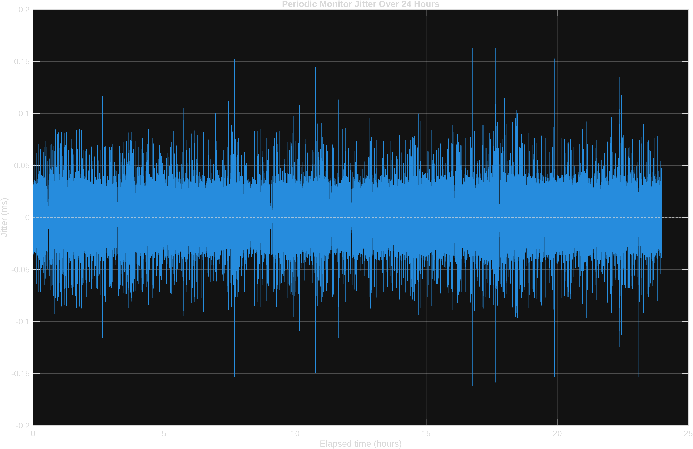
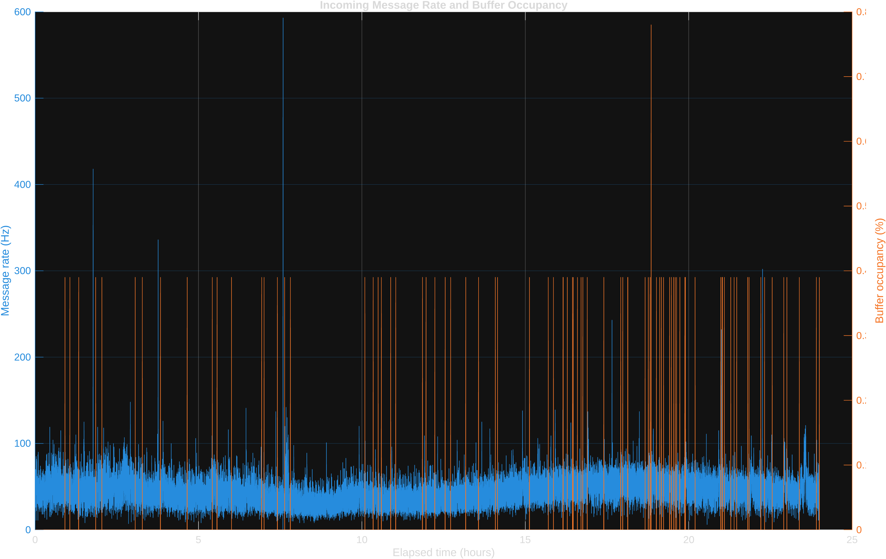
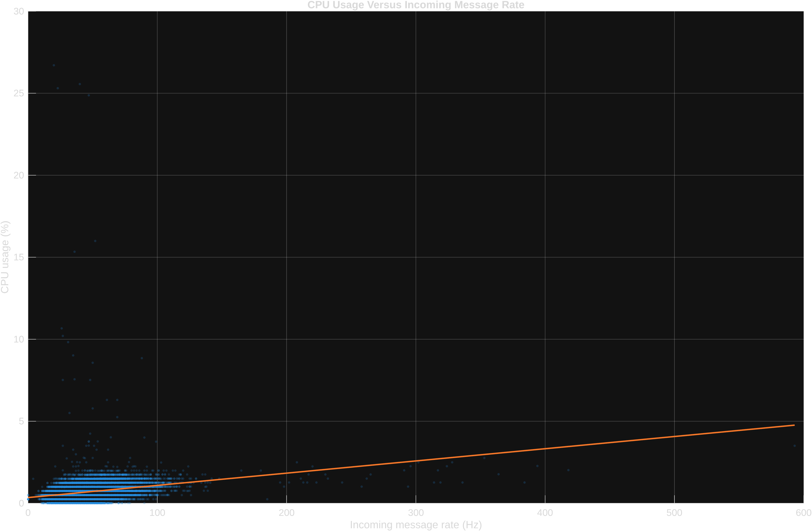

# Πολυνηματικό Σύστημα Πραγματικού Χρόνου για Συλλογή Τηλεμετρίας από το Bluesky Jetstream

**Ονοματεπώνυμο:** Δημήτρης Παπαδημητρίου  
**Μάθημα:** Ενσωματωμένα Συστήματα Πραγματικού Χρόνου  
**Ημερομηνία συλλογής δεδομένων:** 12–13 Ιουλίου 2026  
**Υλικό εκτέλεσης:** Raspberry Pi 4 Model B Rev 1.4, 4 GB RAM  
**Λειτουργικό σύστημα:** Debian GNU/Linux 13 (Trixie)  
**Πυρήνας Linux:** 6.18.34+rpt-rpi-v8, PREEMPT  
**Αρχιτεκτονική:** AArch64  
**Αποθετήριο κώδικα:** https://github.com/dimipapr/espx_26_final.git  

## 1. Σκοπός της εργασίας

Σκοπός της εργασίας ήταν η σχεδίαση και υλοποίηση ενός πολυνηματικού συστήματος πραγματικού χρόνου σε γλώσσα C, το οποίο λαμβάνει ζωντανά δεδομένα από το Bluesky Jetstream Firehose, τα επεξεργάζεται ασύγχρονα και καταγράφει περιοδικά μετρικές λειτουργίας.

Η εφαρμογή συνδέεται μέσω WebSocket στο Jetstream endpoint και λαμβάνει JSON μηνύματα που αντιστοιχούν σε δημόσια γεγονότα του δικτύου AT Protocol. Κάθε μήνυμα ταξινομείται, ανάλογα με το πεδίο `kind`, σε μία από τις κατηγορίες `commit`, `identity`, `account` και `info`.

Η υλοποίηση ακολουθεί το πρότυπο Producer–Consumer με χρήση POSIX threads, mutexes, condition variables και κυκλικού buffer σταθερού μεγέθους. Το τρίτο νήμα εκτελείται περιοδικά ανά ένα δευτερόλεπτο και καταγράφει τις μετρικές σε αρχείο CSV. Οι βασικές απαιτήσεις της εργασίας περιλαμβάνουν τρία ανεξάρτητα νήματα, υπολογισμό χρήσης CPU μέσω του `/proc/stat`, μέτρηση πληρότητας του buffer και περιοδική εκτέλεση χωρίς συσσώρευση χρονικής ολίσθησης.

## 2. Αρχιτεκτονική συστήματος

Η εφαρμογή αποτελείται από τρία βασικά νήματα:

1. **Producer thread:** διαχειρίζεται τη σύνδεση WebSocket και τοποθετεί τα εισερχόμενα JSON μηνύματα στον κυκλικό buffer.
2. **Consumer thread:** αφαιρεί μηνύματα από τον buffer, εκτελεί JSON parsing και ενημερώνει τους μετρητές κάθε κατηγορίας.
3. **Monitor thread:** εκτελείται περιοδικά κάθε ένα δευτερόλεπτο, διαβάζει και μηδενίζει τους μετρητές, υπολογίζει την πληρότητα του buffer και τη χρήση CPU και αποθηκεύει τα αποτελέσματα.

### 2.1 Producer thread

Το νήμα παραγωγού χρησιμοποιεί τη βιβλιοθήκη `libwebsockets` για τη σύνδεση στο Bluesky Jetstream μέσω WebSocket. Η λειτουργία του είναι event-driven, ώστε να εξυπηρετεί άμεσα κάθε νέο δικτυακό frame χωρίς ενεργή αναμονή.

Επειδή ένα μήνυμα JSON μπορεί να κατανεμηθεί σε περισσότερα από ένα WebSocket fragments, ο producer συγκεντρώνει τα τμήματα σε προσωρινό buffer και εισάγει το μήνυμα στην ουρά μόνο όταν επιβεβαιωθεί ότι έχει ληφθεί ολόκληρο.

Η εισαγωγή στον κυκλικό buffer πραγματοποιείται με μη μπλοκαρισμένη λειτουργία. Αν ο buffer είναι πλήρης, το μήνυμα δεν καθυστερεί το δικτυακό event loop, αλλά καταγράφεται ως απορριφθέν μέσω διαγνωστικού μετρητή.

### 2.2 Κυκλικός buffer και συγχρονισμός

Ο bounded circular buffer αποτελείται από 256 θέσεις, με μέγιστο μέγεθος μηνύματος 64 KiB ανά θέση. Η κατάστασή του περιγράφεται από τους δείκτες `head` και `tail`, καθώς και από τον αριθμό των κατειλημμένων θέσεων.

Η πρόσβαση προστατεύεται με `pthread_mutex_t`, ενώ χρησιμοποιείται `pthread_cond_t` για την αφύπνιση του consumer όταν εισάγεται νέο μήνυμα.

Η χρήση ξεχωριστού mutex για τους μετρητές γεγονότων περιορίζει τον χρόνο κλειδώματος και αποτρέπει την άσκοπη αλληλεπίδραση μεταξύ της ουράς και του monitor thread.

Με τον διαχωρισμό των mutexes της ουράς και των μετρητών αποφεύγονται race conditions τόσο κατά την εισαγωγή και αφαίρεση μηνυμάτων όσο και κατά την ταυτόχρονη ενημέρωση και ανάγνωση των στατιστικών.

### 2.3 Consumer thread

Το νήμα καταναλωτή παραμένει σε αναμονή όταν ο buffer είναι άδειος και ενεργοποιείται μέσω condition variable μόλις προστεθεί νέο μήνυμα.

Η ανάλυση JSON πραγματοποιείται με τον ελαφρύ parser `jsmn`. Ο consumer εντοπίζει το πεδίο `kind` και αυξάνει τον αντίστοιχο προστατευμένο μετρητή για τις κατηγορίες `commit`, `identity`, `account` και `info`.

Αν το πεδίο `kind` απουσιάζει, δεν μπορεί να αναλυθεί ή περιέχει μη αναμενόμενη τιμή, το μήνυμα καταγράφεται σε ξεχωριστό διαγνωστικό μετρητή `unknown`. Ο μετρητής αυτός δεν αποτελεί μέρος της υποχρεωτικής τετράδας της εκφώνησης, αλλά χρησιμοποιείται για τον εντοπισμό μη αναγνωρισμένων ή μη έγκυρων μηνυμάτων.

Για λόγους απόδοσης, το νήμα δεν πραγματοποιεί εκτυπώσεις ούτε εγγραφές σε αρχείο. Η λειτουργία του περιορίζεται στην αφαίρεση από την ουρά, την ταξινόμηση και την ενημέρωση των μετρητών.

### 2.4 Monitor thread

Το monitor thread εκτελείται περιοδικά κάθε ένα δευτερόλεπτο με απόλυτο χρονισμό:

```c
clock_nanosleep(CLOCK_MONOTONIC, TIMER_ABSTIME, &next_wakeup, NULL);
```

Η χρήση του `TIMER_ABSTIME` αποτρέπει τη συσσώρευση χρονικής ολίσθησης, επειδή κάθε αφύπνιση βασίζεται σε προκαθορισμένη απόλυτη προθεσμία και όχι στη διάρκεια της προηγούμενης επανάληψης.

Σε κάθε περίοδο, το monitor thread:

* λαμβάνει και μηδενίζει τους μετρητές των τεσσάρων κατηγοριών μηνυμάτων,
* υπολογίζει την τρέχουσα πληρότητα του κυκλικού buffer,
* διαβάζει το `/proc/stat` και υπολογίζει τη χρήση CPU από τη μεταβολή των jiffies,
* λαμβάνει χρονική σήμανση με `clock_gettime(CLOCK_REALTIME)`,
* καταγράφει τις απαιτούμενες μετρικές στo αρχείo `metrics_<timestamp>.csv`.

Παράλληλα, συλλέγει πρόσθετα διαγνωστικά στοιχεία σε ξεχωριστό αρχείο `diagnostics<timestamp>.csv`. Τα στοιχεία αυτά περιλαμβάνουν:

* άγνωστα ή μη ταξινομημένα μηνύματα,
* μηνύματα που απορρίφθηκαν λόγω πλήρους ουράς,
* μηνύματα που υπερέβησαν το μέγιστο μέγεθος,
* τρέχον βάθος ουράς,
* μέγιστο βάθος ουράς που παρατηρήθηκε μέσα στο τελευταίο διάστημα.

Τα πρόσθετα διαγνωστικά δεν αποτελούν μέρος του υποχρεωτικού αρχείου μετρικών. Χρησιμοποιήθηκαν αποκλειστικά για την αξιολόγηση της αξιοπιστίας, της πιθανής απώλειας δεδομένων και της συμπεριφοράς του buffer κατά τη 24ωρη εκτέλεση. Τα πρωτότυπα αρχεία καταγραφής βρίσκονται στο φάκελο `collected_data`.

## 3. Συλλογή και μετα-επεξεργασία δεδομένων

Η εφαρμογή εκτελέστηκε συνεχόμενα για 24 ώρες και παρήγαγε 86.400 εγγραφές, μία για κάθε παράθυρο μέτρησης ενός δευτερολέπτου. Το χρονικό διάστημα του αρχείου ήταν από 12 Ιουλίου 2026, 00:05:16 έως 13 Ιουλίου 2026, 00:05:15.

Το αρχείο `metrics_log.txt` περιείχε τα πεδία:

```text
Seconds,Nanoseconds,Commit_Count,Identity_Count,Account_Count,Info_Count,Buffer_Occupancy_Pct,CPU_Pct
```

Για κάθε εγγραφή υπολογίστηκε ο συνολικός ρυθμός μηνυμάτων:

[
R_i =
Commit_i + Identity_i + Account_i + Info_i
]

Το χρονικό διάστημα μεταξύ δύο διαδοχικών καταγραφών υπολογίστηκε από τα πεδία δευτερολέπτων και νανοδευτερολέπτων. Το jitter ορίστηκε ως:

[
J_i = (t_i - t_{i-1}) - 1\ \text{s}
]

και παρουσιάστηκε σε milliseconds.

Η επεξεργασία και η παραγωγή των διαγραμμάτων πραγματοποιήθηκαν στο MATLAB.

## 4. Αποτελέσματα

Κατά το διάστημα των 24 ωρών ταξινομήθηκαν συνολικά **3.743.398 μηνύματα**. Ο μέσος ρυθμός ήταν **43,326 μηνύματα ανά δευτερόλεπτο**, ενώ η μέγιστη τιμή ήταν **593 μηνύματα ανά δευτερόλεπτο**. Τα δεδομένα επιβεβαιώνουν ότι η δικτυακή κίνηση δεν ήταν σταθερή αλλά παρουσίαζε σύντομα bursts.

### 4.1 Jitter περιοδικού νήματος



**Σχήμα 1:** Απόκλιση της περιόδου εκτέλεσης του monitor από το ιδανικό διάστημα του ενός δευτερολέπτου.

Ο μέσος χρόνος μεταξύ δύο διαδοχικών καταγραφών ήταν:

[
1{,}000000000121\ \text{s}
]

Το μέγιστο απόλυτο jitter ήταν **0,179502 ms**, ενώ το 99ο εκατοστημόριο του απόλυτου jitter ήταν **0,065794 ms**. Η μέση τιμή του jitter ήταν πρακτικά μηδενική.

Τα αποτελέσματα δείχνουν ότι η χρήση απόλυτων deadlines απέτρεψε τη συσσώρευση drift. Ακόμη και μετά από 24 ώρες, οι εγγραφές παρέμειναν ευθυγραμμισμένες με περίοδο ενός δευτερολέπτου.

### 4.2 Ρυθμός μηνυμάτων και πληρότητα buffer



**Σχήμα 2:** Ρυθμός εισερχόμενων μηνυμάτων και στιγμιαία πληρότητα του κυκλικού buffer.

Παρότι ο ρυθμός μηνυμάτων παρουσίασε σημαντικές διακυμάνσεις και έφτασε στιγμιαία τα 593 Hz, η μέγιστη πληρότητα που καταγράφηκε κατά την περιοδική δειγματοληψία ήταν μόνο **0,78%**.

Η τιμή αυτή αντιστοιχεί σε δύο θέσεις από τις 256. Από τα διαγνωστικά δεδομένα προέκυψε ότι η μέγιστη ουρά που εμφανίστηκε οποιαδήποτε στιγμή μέσα σε ένα διάστημα ήταν τέσσερις θέσεις, δηλαδή:

[
\frac{4}{256}\times100 = 1{,}5625%
]

Δεν καταγράφηκε κανένα μήνυμα που να απορρίφθηκε επειδή ο buffer ήταν πλήρης. Η μικρή πληρότητα δείχνει ότι ο consumer μπορούσε να επεξεργάζεται τα μηνύματα ταχύτερα από τον μέσο και τον στιγμιαίο ρυθμό άφιξης.

### 4.3 Χρήση CPU και εισερχόμενος ρυθμός



**Σχήμα 3:** Συσχέτιση του ρυθμού εισερχόμενων μηνυμάτων με τη χρήση CPU.

Η μέση χρήση CPU ήταν **0,668%**, επομένως η CPU παρέμεινε αδρανής κατά μέσο όρο κατά **99,332%**. Η μέγιστη καταγεγραμμένη χρήση ήταν **26,70%**.

Ο συντελεστής συσχέτισης μεταξύ ρυθμού μηνυμάτων και χρήσης CPU ήταν:

[
r = 0{,}2846
]

Η θετική αλλά σχετικά ασθενής συσχέτιση δείχνει ότι η χρήση CPU αυξάνεται όταν αυξάνεται ο ρυθμός μηνυμάτων, αλλά επηρεάζεται επίσης από άλλες διεργασίες του λειτουργικού συστήματος και από τη χρονική διάρκεια της επεξεργασίας.

## 5. Αξιοπιστία και λειτουργία μεγάλης διάρκειας

Η εφαρμογή παρέμεινε ενεργή για ολόκληρο το διάστημα των 24 ωρών και παρήγαγε 86.400 συνεχόμενες εγγραφές χωρίς κενά, διπλότυπα ή αντιστροφή χρονικής σειράς.

Κατά την εκτέλεση παρατηρήθηκαν:

| Μετρική                              |        Τιμή |
| ------------------------------------ | ----------: |
| Συνολικά ταξινομημένα μηνύματα       |   3.743.398 |
| Μέσος ρυθμός                         |   43,326 Hz |
| Μέγιστος ρυθμός                      |      593 Hz |
| Μέση χρήση CPU                       |      0,668% |
| Μέγιστη χρήση CPU                    |      26,70% |
| Μέγιστη πληρότητα κατά την καταγραφή |       0,78% |
| Μέγιστο βάθος ουράς ανά διάστημα     |       4/256 |
| Απορρίψεις λόγω γεμάτου buffer       |           0 |
| Μηνύματα μεγαλύτερα από 64 KiB       |          58 |
| Άγνωστα ή μη ταξινομημένα μηνύματα   |         739 |
| Μέγιστο απόλυτο jitter               | 0,179502 ms |

Τα 58 truncated μηνύματα αντιστοιχούν σε περίπου 0,00155% σε σχέση με τον αριθμό των επιτυχώς ταξινομημένων μηνυμάτων.
Επομένως, δεν παρατηρήθηκε απώλεια λόγω κορεσμού της ουράς, αλλά ένας πολύ μικρός αριθμός μηνυμάτων ξεπέρασε το σταθερό όριο των 64 KiB.

Η χρήση στατικών buffers και η αποφυγή δυναμικής δέσμευσης μνήμης ανά μήνυμα μειώνουν σημαντικά τον κίνδυνο memory leaks. Κατά τη 24ωρη εκτέλεση δεν παρατηρήθηκε αύξηση αστάθειας, segmentation fault ή μη αναμενόμενος τερματισμός.

Σε περίπτωση διακοπής της σύνδεσης WebSocket, η τρέχουσα υλοποίηση ανιχνεύει το σφάλμα και τερματίζει ελεγχόμενα την εφαρμογή. Δεν έχει υλοποιηθεί εσωτερικός μηχανισμός αυτόματης επανασύνδεσης. Η εφαρμογή μπορεί να εκτελείται ως υπηρεσία `systemd`, ώστε να είναι δυνατή η επανεκκίνησή της σε περίπτωση αποτυχίας, εφόσον έχει οριστεί κατάλληλη πολιτική επανεκκίνησης.

## 6. Συμπεράσματα

Η υλοποίηση ικανοποίησε τις βασικές απαιτήσεις ενός πολυνηματικού συστήματος πραγματικού χρόνου για ασύγχρονη λήψη, επεξεργασία και περιοδική καταγραφή δεδομένων.

Ο διαχωρισμός των λειτουργιών σε producer, consumer και monitor threads επέτρεψε στο δίκτυο, στο JSON parsing και στην εγγραφή μετρικών να λειτουργούν ανεξάρτητα. Η χρήση mutexes και condition variables απέτρεψε race conditions και περιττή ενεργή αναμονή.

Τα πειραματικά αποτελέσματα έδειξαν ότι:

* το περιοδικό νήμα διατήρησε εξαιρετικά μικρό jitter,
* δεν εμφανίστηκε συσσωρευμένο drift,
* ο κυκλικός buffer παρέμεινε σχεδόν πάντα άδειος,
* δεν απορρίφθηκαν μηνύματα λόγω κορεσμού του buffer,
* η μέση χρήση CPU παρέμεινε κάτω από 1%,
* η εφαρμογή λειτούργησε συνεχόμενα για 24 ώρες.

Συνεπώς, το σύστημα μπορεί να υποστηρίξει τον παρατηρούμενο ρυθμό του Jetstream Firehose με σημαντικό περιθώριο απόδοσης. Ως μελλοντικές βελτιώσεις προτείνονται η προσθήκη μηχανισμού αυτόματης επανασύνδεσης σε περίπτωση προσωρινής απώλειας του δικτύου, καθώς και η μείωση του σταθερού μεγέθους μνήμης ανά θέση της ουράς με δυναμική δέσμευση πρόσθετου χώρου μόνο για μηνύματα που υπερβαίνουν το προκαθορισμένο όριο. Με αυτόν τον τρόπο διατηρείται η αρχιτεκτονική Producer–Consumer, μειώνεται η συνολική κατανάλωση μνήμης και αποφεύγεται η πρόωρη απόρριψη μεγάλων μηνυμάτων πριν αναλυθεί το πεδίο `kind`.
